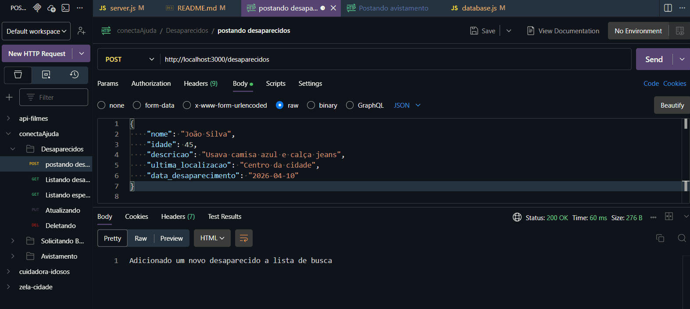
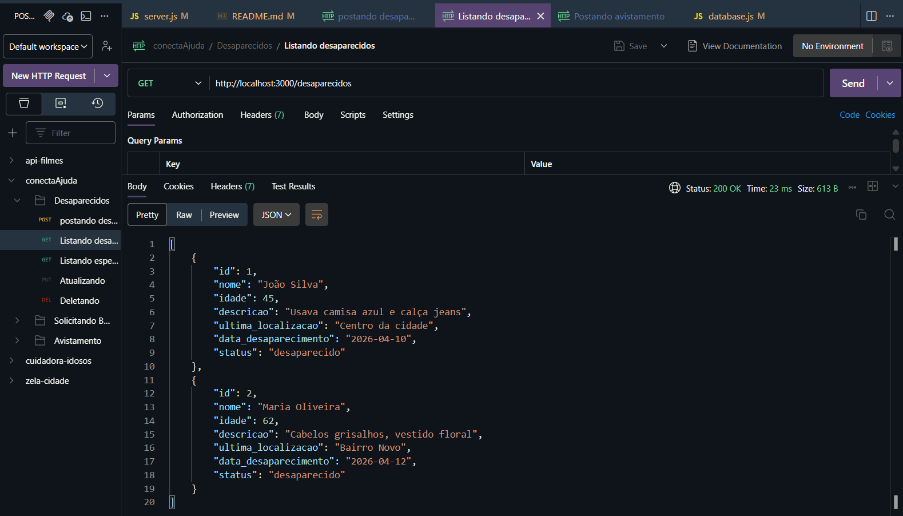
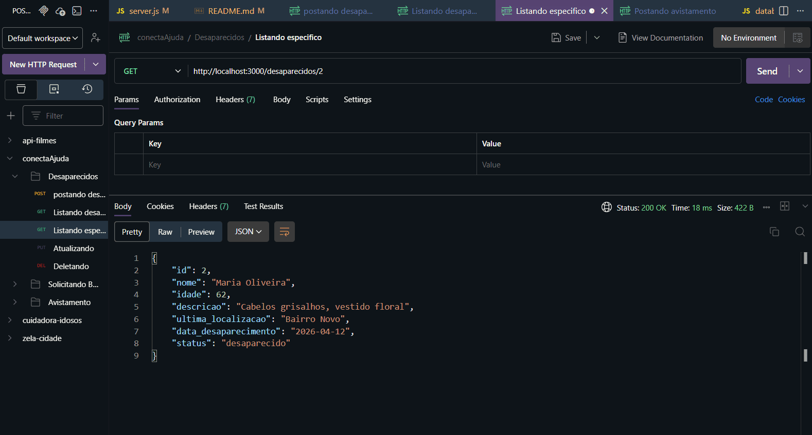
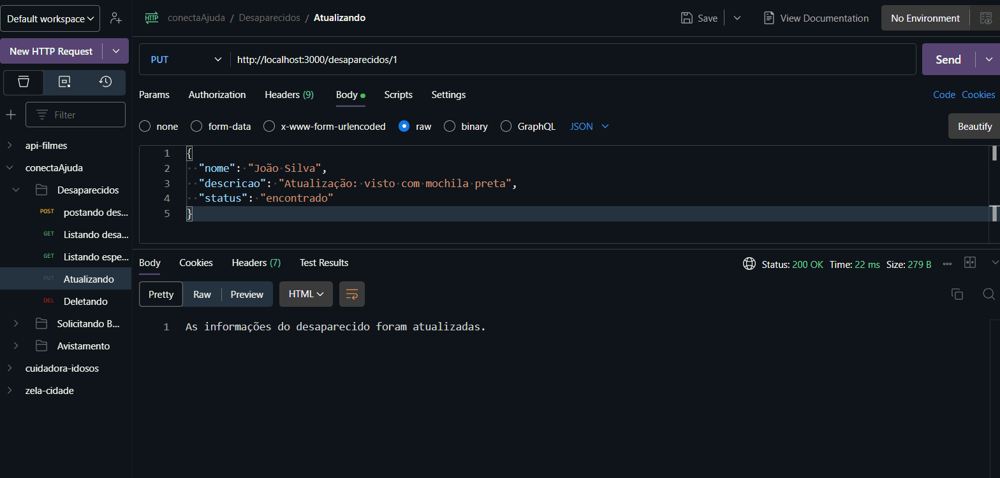
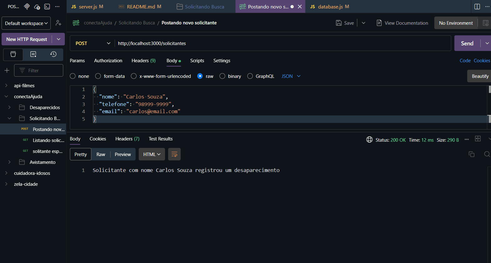
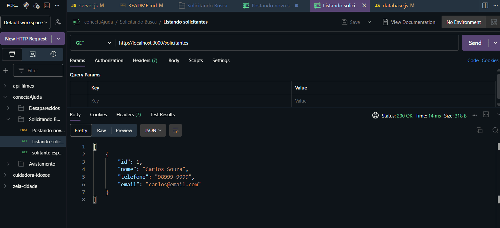
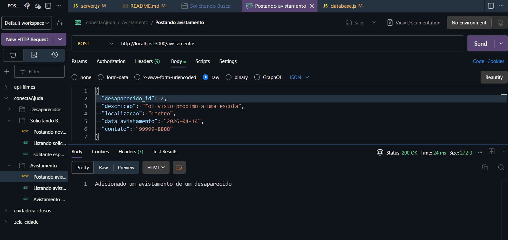
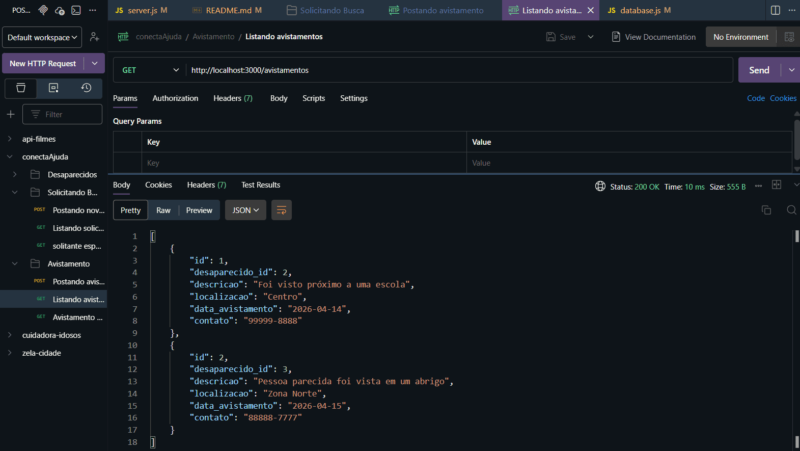

# Conecta Ajuda: Desaparecidos

Sistema de registro para pessoas desaparecidas

## 1 - Apresentação da ideia

Este projeto foi desenvolvido a partir do desafio sobre enchentes no Brasil. Ao analisar o cenário, percebi a falta de organização nas buscas por pessoas desaparecidas, assim motivando a criar uma solução.

## 2 - Problema escolhido

O problema central é a busca pelas pessoas desaparecidas durante a enchente.

- Dificuldade Enfrentada: Desorganização das informações sobre desaparecidos, dificultando as buscas.
- Público Impactado: Pessoas desaparecidas, familiares e voluntários nas buscas.
- Relevância: Esse sistema seria importante para a organização das buscas nos locais certos e podendo também ajudar a mostrar quem já foi encontrado, assim acelerando as buscas.

## 3 - Solução Proposta

- Esse sistema funciona registrando a pessoa desaparecida, podendo descrever e colocar uma foto dessa pessoa e também informando o último local que a pessoa foi vista.
- Como diferencial temos o status de encontrado, assim fazendo com que a pessoa desaparecida saia do banco de dados.

## 4 - Estrutura do Sistema

- Front-end: Apresenta um formulario para registros dos desaparecidos e uma lista com informações dos que precisam de ajuda nas buscas.
- Back-end: É feito em Node.JS, onde as informações são processadas e depois enviadas para o cliente.
- Banco de dados: Aqui são armazendados todos os dados necessarios para o registros dos desaparecidos.

---

## 🛠️Tecnologias utilizadas

- Node.js
- Express
- SQLite
- Postman
- Nodemon

---

## 📥Instalação

Clone o repositório e instale as dependências:

```bash
npm install
```

### ▶️Como Executar o Projeto

```bash
npm run dev
```

`http://localhost:3000
`

[Clique Aqui](http://localhost:3000)

---

## 🗄️Estrutura do Banco de Dados

O banco de dados é composto por 3 tabelas:

### 🧾Tabela: desaparecidos

Armazena as informações dos desaparecidos.

| Campo                            | Descrição                        |
|----------------------------------|----------------------------------|
|id                                | Identificador do desaparecido    |
|nome                              | Nome do desaparecido             |
|idade                             | Idade do desaparecido            |
|descricao                         | descrição física do desaparecido |
|ultima_localizacao                | Lugar onde foi visto por ultimo  |
|data_desaparecimento              | Dia do desaparecimento           |
|status                            | Status do desaparecido           |


### 🧾Tabela: solicitantes

Armazena informações de contato do solicitante.

| Campo                            | Descrição                        |
|----------------------------------|----------------------------------|
| id                               | Identificador do solicitante     |
|nome                              | nome do solicitante             |
|telefone                          | telefone do solicitante          |
|email                             | email do solicitante             |

### 🧾Tabela: avistamentos

Armazena os relatos de avistamentos.

| Campo                            | Descrição                        |
|----------------------------------|----------------------------------|
| id                               | Identificador do avistamento     |
| desaparecido_id                  | Id do desaparecido relacionado   |
| descricao                        | Descriçao do avistamento         |
| localizacao                      | Local onde foi avistado          |
| data_avistamento                 | Data do avistamento              |
| contato                          | Número para contato              |

---

## 🔗Endpoints

### Rota Inicial

Retorna uma página simples com informações da API.

```http
GET /
```

### Rotas da tabela desaparecidos

#### 🔍Listando (GET)

Retorna todos os desaparecidos do Banco de Dados.

```http
GET /desaparecidos
```

Retorna um desaparecido especifico (ID).

```http
GET /desaparecidos/:id
```

#### 📤Postando (POST)

Criando um novo desaparecidos no Banco de Dados.

```http
POST /desaparecidos
```

Body (JSON)

```json
{
  "nome": "Julia Silva",
  "idade": 13,
  "descricao": "Cabelos loiros, vestido preto e baixa",
  "ultima_localizacao": "Bairro Jardim das flores",
  "data_desaparecimento": "2026-04-12"
}
```

#### 🔄Atualizando (PUT)

Atualizando um desaparecido.

```http
PUT /desaparecidos/:id
```

Body (JSON)

```json
{
  "nome": "João Silva",
  "descricao": "Atualização: visto com mochila preta",
  "status": "encontrado"
}
```

#### 🗑️Deletando(DELETE)

Deletando um desaparecido.

```http
DELETE /desaparecidos/:id
```

### Rotas da tabela solicitantes

#### 🔍Listando (GET)

Retorna todos os solicitantes do Banco de Dados.

```http
GET /solicitantes
```

Retorna um solicitante especifico (ID).

```http
GET /solicitantes/:id
```

#### 📤Postando (POST)

Criando um novo solicitante no Banco de Dados.

```http
POST /solicitantes
```

Body (JSON)

```json
{
  "nome": "Carlos Souza",
  "telefone": "98999-9999",
  "email": "carlos@email.com"
}
```

### Rotas da tabela avistamentos

#### 🔍Listando (GET)

Retorna todos os avistamentos do Banco de Dados.

```http
GET /avistamentos
```

Retorna um avistamento especifico (ID).

```http
GET /avistamentos/:id
```

#### 📤Postando (POST)

Cria um novo avistamento no Banco de Dados.

```http
POST /avistamentos
```

Body(JSON)

```json
{
  "desaparecido_id": 3,
  "descricao": "Pessoa parecida foi vista em um abrigo",
  "localizacao": "Zona Norte",
  "data_avistamento": "2026-04-15",
  "contato": "88888-7777"
}
```
---

## 🔐Segurança

A API utiliza `?` nas queries SQL:

```http
WHERE id = ?
```

Isso evita o SQL injection.

---

## Teste no Postman

### 📷POST desaparecidos



### 📷GET desaparecidos



### 📷GET desaparecidos Especifico



### 📷PUT desaparecidos



### 📷POST solicitantes



### 📷GET solicitantes



### 📷POST avistamentos



### 📷GET avistamentos




## 👨‍💻Autor

Projeto desenvolvido por: Tallis Vinicius De Jesus Da Silva

